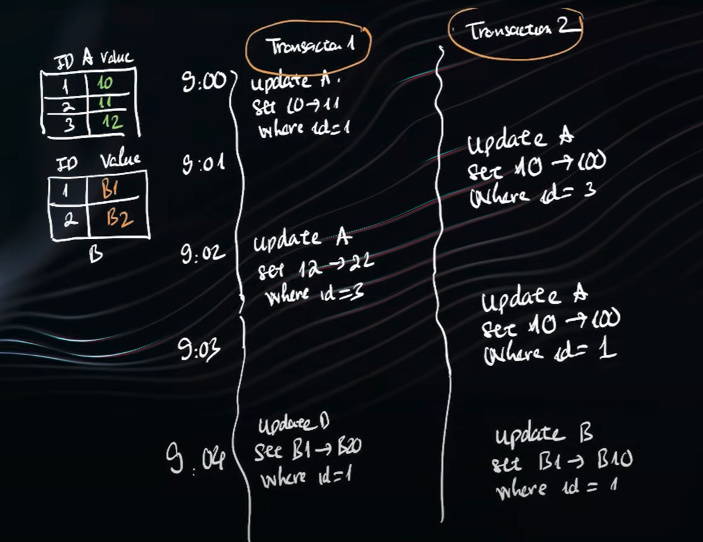
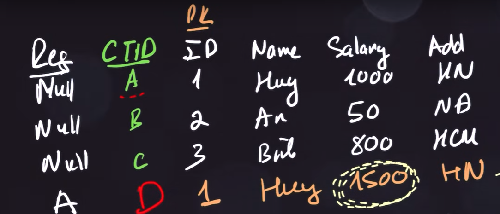

# Database architecture

MVCC, Query optimizer, Lock, ...

## Backup and restore data

- Before any changes are applied to the main database files on disk (datafile), they are first recorded in an append-only log called the WAL (event not commit yet) => Write to wal sequentially
- Apply log: After db is up again, it will search for wal and update until the latest status
- Undo: Use rollback information to undo uncommited data

## Lock

### Index lock

The nature of index is just a place to save list value of that column in asc order (default), so when we update a record, db need to lock the index to rebuild it

### Escalating lock

If there is a table with lots of row (100m for example), user execute an update statement that will lock 99% of this table, this cost a lot because db also need resource to know which object is locked, so it will lock the whole table instead of 99%
=> Each db has different rule for escalating lock but Oracle do not escalating lock

### Dead lock

Happen when 2 transactions waiting for the other one to release the lock

When dead lock happen, system will kill/abort 1 transaction and it will choose the one that use less resource, because this transaction cost less to rollback

How to avoid:
- If need to update multi tables, try to do it in the same order accross all transactions 
    

- But above solution not completely resolve issue, for example:
    

=> If need to update multi record in the same table, try to get all the lock at once, for example "select ... where id = 1 and id = 3 for update" or "update ... where id = 3 and id = 3"

## MVCC (Multi version concurrent control)

Problem: when user A update record A from value 0 -> 1 but not commit yet, then user B query record A should see value 0 and user A query record A should see value 1, how 2 users query the same record at the same time but see two different values.
=> All types of db utilize MVCC to solve this problem, but have different implementation

### MVCC in Postgresql

When update record A (ctid A) in table A, postgresql insert another record with updated value to that same table, user A will query the old record and other users will query the inserted record. The inserted record will have different ctid that reference ctid A for rollback. ctid is a system column that exists in every table and represents the physical location of a row version

After commit or rollback, 1 of 2 row becomse useless, postgre use vacuum to clear these useless column periodically

This causes:
- Need to rebuild index of all columns
- At a time, number of real rows is just some millions but number of rows in table can be more than 2 or 3 times
- Process to clear unused rows happen inside real table, which will affect performance

### MVCC in Mysql

Mysql have a space called undo, when update, it update directly to record and save old value in undo space. User A  see value of record in table, other users see value in undo space

This help:
- Only need to rebuild index of updated column
- Number of real rows and rows in table is always the same
- Process to clear unused record in undo space, not tables, which will not affect performace

## Execution steps for query

When user execute a query statement, there are 6 steps:
- Check syntax
- Check context (Ex: if queried column exist in table or if user has permission to access that column)
=> Above 2 steps not affect performace
- Check execution plan in cache
- If execution plan not found in cache, it need to analyze and choose the execution plan that cost least (exetremely complex)
=> This is the factor to evaluate db's performance (Ex: Postgresql can rewrite the whole subquery, while mysql just analyze it normally), which make a db expensive or not
- Create the choosen execution plan
- Execute it

=> This why when we update db's version, same query in same context can be faster, just because the query optimizer to analyze execution plan has been improved