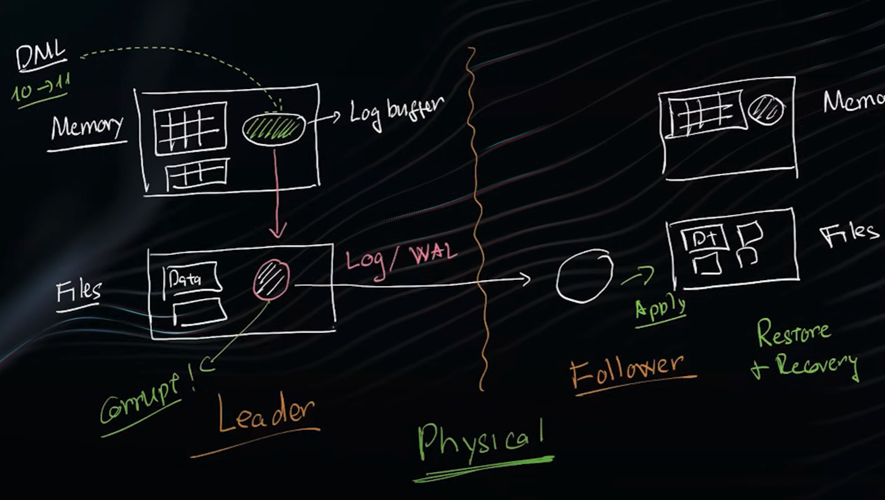

# Database replication

Master-slave or multi-master

## Comparing

- Master-slave: 1 RW and other can only R => optimized for system mainly using R
- Multi-master: multi RW => optimized for system mainly using W (Avoid using because of concurrent update overhead, for example 2 db update the same record at the same time)

## How to sync

2 ways to sync data from master to slave:
- Use the same SQL
- Use the same strategy as restoring DB

DB has 2 parts, memory and files (physical), the DML information will be first stored at a place in memory called Log Buffer, then stored at a place in files called WAL in posgresql or transaction log in mysql
=> Use process to apply information from master wal/log files to slave wal/log files
=> Called Physical way because using file

## Replication lag
Solution:
- Only commit master after sync successfully (slow down master)
- Directly move log buffer from master to slave (cut down time by not moving data to files but using only memory may risk losing data when encountering electricity issue)
- Config an optimized disk for faster IO operation, for example SSD, to just store master/slave wal/log files (some MB or GB instead of datafile up to TB), 
- Use the same disk to store master and slave wal/log files

