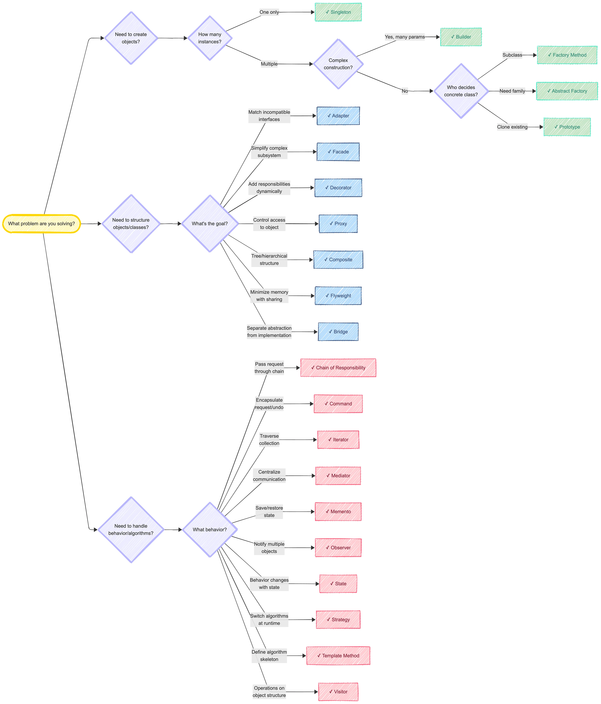

# Design pattern

Decision tree

## Creational patterns

Are you choosing implementations based on context? 
- Factory
- Abstract factory

Comparision: Both used to create objects without specifying concrete class. Factory pattern creates a single object while abstract factory creates a family of related objects to ensure compatible groups of objects are created together