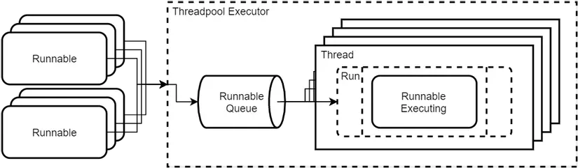

# Java core

## Scenario Based Interview Questions
difference between ++num and num++ ? 
what is the result ?
```
List<Integer> list = Arrays.asList(1, 2, 3);
for (int i = 0; i < list.size(); ++i) {
    int item = list.get(i);
    int num = item++ + ++item;
    System.out.println(num);
}
```

## SOLID
Single responsibility
- Your class or method should have only one responsibility
- Your class or method should have only one reason to change

Open/Closed Principle
- A class should be open for extension and closed to modification
- In simpler term, you should be able to add new functionality to a class without changing its existing code
=> Avoid introducing bugs to a working application

Liskov’s Substitution Principle
- A class should be able to be replaced with a subclass without causing any problems like throw exception
```
// Incorrect implementation 
public class Bird {
    public void fly() {
        // I can fly
    }

    public void swim() {
        // I can swim
    }
}

public class Penguin extends Bird {

    // Penguins cannot fly, but we override the fly method and throws Exception => violating LSP
    @Override
    public void fly() {
        throw new UnsupportedOperationException("Penguins cannot fly");
    }
}

// Correct implementation
public class Bird {

    // methods
}

public interface Flyable {
    void fly();
}

public interface Swimmable {
    void swim();
}


public class Penguin extends Bird implements Swimmable {
    // Penguins cannot fly, therefore we only implement swim interface
    @Override
    public void swim() {
        System.out.println("I can swim");
    }
}
```

Interface Segregation Principle
- Larger interfaces should be split into smaller ones
=> Ensuring that a class is not forced to implement methods it does not need

Dependency Inversion Principle
- High level modules should not depend on low level modules; both should depend on abstractions
- Interface (abstraction) should not depend on details (classes should communicate through interface, not implementation)

## Multi-threading
Thread là một đơn vị xử lý cơ bản trong hệ thống

Có 2 cách tạo thread:
  - Extend Thread và hiện thực hàm run để define task. Để execute task này thì khởi tạo đối tượng extend Thread đó rồi call method start, java sẽ cấp phát tài nguyên và chạy phương thức run trên 1 thread mới. Nếu call method run trực tiếp thì phương thức sẽ được thực thi trên current thread. Hàm start chỉ được call 1 lần nếu không sẽ IllegalThreadStateException.
  - Implement Runnable và hiện thực hàm run để define task. Để execute task này thì khởi tạo class runnable và truyền vào tham số khi khởi tạo class thread rồi call method start của Thread.

Runnable được prefer vì:
  - Seperate logic giữa task definition và execution
  - Compatible với ThreadPool do work well với ExecutorService

Thread pool dùng để giới hạn số lượng thread cùng 1 thời điểm, bên trong có 1 queue dùng để chứa các task, khi thread nào trống sẽ lấy task trong queue này ra để execute. Vậy bản chất của Thread pool là chuỗi các thread đang chờ để kéo các Runnable trong queue ra để thực hiện theo các phương thức run riêng của chúng.
`


Callable giống với Runnable nhưng thay vì sử dụng void run thì sử dụng hàm call và có trả về kết quả hoặc throw checked exception. Khi Executor submit 1 callable sẽ trả về Future, call method get để block current thread cho đến khi trả về kqua. Có 1 số nhược điểm như k hỗ trợ built-in exception handling, k bắt được sự kiện sau khi task done, ...

=> CompletableFuture:
- Task chaining: thenApply(result -> result + 1), thenAccept(result -> logger.info(result))
- Built-in exception handling: exceptionally()
- Combine multiple tasks: allOf, anyOf

Base interface là Executor

khi config thread pool trong SpringBoot, nên return DelegatingSecurityContextAsyncTaskExecutor để thread có security context

## Data type
2 loại kiểu dữ liệu chính:

8 kiểu dữ liệu nguyên thủy
- byte (0)
- int
- long
- short
- double (0.0d)
- float (0.0f)
- boolean: false
- char

kiểu dữ liệu tham chiếu k trực tiếp lưu giá trị mà lưu địa chỉ bộ nhớ nơi giá trị dc lưu trữ: class, interface, array, enum

autoboxing là chuyển đổi primitive type sang wrapper class: Integer i = 1
unboxing là chuyển đổi wrapper class sang primitive type: int i = new Integer(1)

double và float đều biểu diễn số thực nhưng double biểu diễn chính xác hơn do 8 byte (64 bit), float 4 byte (32 bit)

String vs StringBuffer vs StringBuilder:
- String là immutable, khi += thực ra đang tạo ra 1 object String mới, StringBuilder và StringBuffer là mutable nhưng StringBuffer thread-safe còn StringBuilder thì k, String là bất biến nên luôn an toàn
- Hiệu suất StringBuilder nhanh nhất do k có chi phí đồng bộ hóa, tới StringBuffer và String chậm nhất khi phải thay đổi nhiều

## OOP
OOP là một phương pháp lập trình phổ biến dựa trên khái niệm quan trọng: class và object
class sẽ define các thuộc tính và phương thức, là 1 khuôn mẫu của các đối tượng
- Tính đóng gói (encapsulation): giúp ẩn đi những chi tiết triển khai bên trong và chỉ hiển thị chức năng thông qua 1 giao diện
- Tính kế thừa (inheritance): cho phép inherit toàn bộ phương thức và thuộc tính của 1 lớp đã tồn tại -> giúp tái sử dụng code và tạo ra cấu trúc phân cấp
- Tính đa hình (polymorphism): cho phép perform cùng 1 action trên các đối tượng khác nhau theo các cách khác nhau
- Tính trừu tượng (abstraction): cho phép define các lớp và phương thức trừu tượng giúp ẩn đi các chi tiết triển khai bên trong

```
abstract class Vehicle {
    private String brand;   // Encapsulation (đóng gói)

    public Vehicle(String brand) {
        this.brand = brand;
    }

    // Getter + Setter (đóng gói)
    public String getBrand() {
        return brand;
    }

    // Abstract method (trừu tượng)
    abstract void drive();
}

class Car extends Vehicle {
    public Car(String brand) {
        super(brand);
    }

    @Override
    void drive() {  // Polymorphism
        System.out.println(getBrand() + " car is driving on the road.");
    }
}
```

access modifier:
- public: truy cập ở bất cứ đâu
- protected: các lớp trong cùng 1 package hoặc lớp con
- package-private (default when no access modifier): các lớp trong cùng 1 package
- private: Chỉ trong lớp đó


## Exception
exception là các ngoại lệ làm crash chương trình, có 3 loại:
- checked exception: xảy ra tại compile time, thường là các tình huống đã được chương trình dự đoán và bắt phải handle. Ví dụ như IOException, SQLException
- unchecked exception: xảy ra tại runtime, thường là do lỗi lập trình như chia cho 0 ArithmeticException, NullPointerException
- error: là các lỗi nghiêm trọng vượt ngoài tầm xử lý của dev vd như OutOfMemoryError, StackOverflowError

Throws: được khai báo ở cuối chữ kí của phương thức dùng để khai báo 1 phương thức có thể ném ra 1 hoặc nhiều exception. Khi phương thức đó được gọi, bắt buộc xử lý những exception này
```
public void myMethod() throws IOException, SQLException {
    // Mã có thể ném ra IOException hoặc SQLException
}
```

## Interface
Interface là một tập hợp các phương thức trừu tượng, có thể có các field nhưng java tự động làm các field này thành static và final
Marker interface là interface k có gì hết, dc dùng để cung cấp thông tin cho JVM, vd như Serializable

vs Abstract class
- interface chỉ có thể chứa abstract method còn abstract class có thể chứa thêm method đã được triển khai
- abstract có thể chứa biến instance k phải private, trong khi interface k thể
- 1 lớp chỉ có thể extend 1 abstract class nhưng có thể implement nhiều interface

## equals vs ==
== khi dùng với primitive type thì sẽ so sánh giá trị trực tiếp, còn khi dùng với object thì sẽ so sánh tham chiếu (địa chỉ bộ nhớ), nghĩa là check xem 2 biến có cùng tham chiếu đến 1 đối tượng trong bộ nhớ hay k
equals có thể được override so sánh nội dung, vd như String override để so sánh chuỗi => an toàn hơn
tuy nhiên == có thể được sử dụng cho enum vì mỗi hằng số enum được đảm bảo là duy nhất 

## Comparable vs Comparator
Comparable được implement bởi 1 đối tượng để so sánh với 1 đối tượng khác, override phương thức compareTo(Object o)
Comparator được implement để so sánh 2 đối tượng, override phương thức compare(Object o1, Object o2)

## Process vs Thread
- Process là 1 chương trình đang chạy, mỗi process có không gian bộ nhớ riêng biệt
- Thread là một đơn vị xử lý cơ bản trong hệ thống chạy trong process context -> 1 process có nhiều thread, các thread trong cùng 1 process chia sẻ không gian bộ nhớ


## Collection
Iterator là 1 interface cung cấp các method duyệt qua phần tử của Collection: next, hasNext, remove

interface gốc là Collection
các interface con và lớp triển khai:
- List: LinkedList, ArrayList
- Set: HashSet, TreeSet
- Queue: ArrayDeQue, PriorityQueue
- Map: HashMap, TreeMap, ConcurrentMap

Array vs ArrayList:
- ArrayList chỉ có thể lưu trữ đối tượng, trong khi Array có thể lưu thêm primitive type
- Array thao tác nhanh hơn do kích thước cố định, ArrayList thao tác chậm hơn do phải duy trì kích thước động và các phương thức phức tạp

LinkedList vs ArrayList:
- ArrayList cho phép truy cập ngẫu nhiên nhanh hơn nhưng bù lại perform write lâu hơn do phải dịch chuyển các phần tử, LinkedList truy cập ngẫu nhiên lâu hơn do phải duyệt qua từng Node nhưng write nhanh hơn do chỉ cần update pointer
- ArrayList qly bộ nhớ hiệu quả hơn do sử dụng mảng động có thể tăng giảm kích thước mảng tùy theo số lượng item, LinkedList dùng thêm bộ nhớ cho pointer giữa các node

HashSet vs TreeSet:
- HashSet k duy trì thứ tự, TreeSet duy trì thứ tự lớn bé -> HashSet nhanh hơn khi thao tác write hoặc get
- HashSet cho phép 1 giá trị null còn TreeSet thì k nếu k custom Comparator

HashMap vs LinkedHashMap vs TreeMap:
- HashMap k duy trì thứ tự, LinkedHashMap duy trì thứ tự chèn, TreeMap duy trì thứ tự lớn bé
- HashMap nhanh nhất khi thao tác k cần thứ tự, LinkedHashMap cân bằng giữa hiệu suất và duy trì thứ tự, TreeMap hiệu quả với các thao tác sắp xếp nhưng write chậm do phải duy trì cấu trúc cây

HashCode là method trả về giá trị int dùng để phân phối đối tượng trong các cấu trúc dữ liệu dựa trên bảng băm. Phải ghi đè HashCode và equals cùng lúc để 2 đối tượng bằng nhau có giá trị hash code giống nhau, nếu k 2 đối tượng bằng nhau sẽ được xử lý theo 2 đối tượng khác nhau trong các cấu trúc dữ liệu dựa trên bảng băm.

Cơ chế hoạt động của HashMap: 
- Khi thêm 1 cặp key-value, HashMap sử dụng hàm hashCode để tính giá trị băm, giá trị này đại diện cho vị trí của Entry trong bảng băm hay còn gọi là bucket
- Khi dùng get thì HashMap cũng dùng hashCode để tính giá trị băm của key như lúc put để tìm đến bucket chứa key và trả về value
- Khi 2 key khác nhau có cùng 1 giá trị hash thì trong cùng 1 bucket, HashMap sẽ lưu các Entry dưới dạng LinkedList, khi số lượng phần tử vượt quá threshold thì sẽ chuyển sang cây cân bằng.
- Khi xảy ra va chạm, HashMap duyệt qua các phần tử trong cùng bucket và sử dụng hàm equals để xác định xem key đã tồn tại chưa khi put và tìm kiếm key ghi get
- HashMap cho phép 1 key null được lưu trữ ở bucket đầu tiên: bucket0

## Serialize
Serialize dùng để chuyển đổi đối tượng thành 1 dạng có thể lưu vào file, database hoặc truyền qua network thường là dưới dạng luồng byte, Deserialize ngược lại dùng để chuyển đổi luồng byte thành đối tượng.
Sẽ có các field sensitive như password k muốn serialize thì dùng transient.
Cần chú ý version của class vì thay đổi có thể khiến Deserialize k thành công

## Garbage collection
khi khởi tạo 1 biến, java cấp phát bộ nhớ cho nó, khi biến k còn bất kì tham chiếu nào tới, nó có thể được dọn dẹp bởi garbage collector để giải phóng bộ nhớ. Có thể custom thêm behavior trước khi giải phóng bộ nhớ bằng cách override method finalize. Khi 1 biến k còn tham chiếu, nó có thể được dọn dẹp nhưng k phải ngay lập tức, việc dọn lúc nào tùy vào các thuật toán của garbage collector và các yếu tố như bộ nhớ còn lại trong heap, ...

## Other
java luon sử dụng Pass by value là copy giá trị của đối tượng rồi chuyền vào param nhưng việc chuyền tham chiếu của đối tượng có thể tạo ra hiệu ứng tương tự như pass by reference

Biến instance là attribute của 1 class, được khai báo trong class nhưng ngoài method

K thể override private, static, final method

java chỉ có thể extend 1 class => k hỗ trợ đa kế thừa do các vấn đề như 2 class có cùng 1 method, instead sử dụng interface

Phạm vi sử dụng biến: 
- biến local: khai báo trong phương thức, truy cập bên trong phương thức đó
- biến instance: khai báo bên trong class nhưng ngoài phương thức, truy cập bên trong phương thức của class đó
- biến static: khai báo bên trong class nhưng ngoài phương thức với từ khóa static, truy cập bên trong phương thức của class đó và bên ngoài class thông qua tên class (ClassName.staticVariable) nếu k private
- biến global: java k có concept biến global nhưng biến static k private cũng có thể coi là biến global

Synchronized được sử dụng khi cần đảm bảo chỉ 1 luồng có thể truy cập 1 đoạn mã tại 1 thời điểm

volatile dùng để thông báo 1 biến có thể bị thay đổi bởi các thread khác nhau tại cùng 1 thời điểm, vì vậy khi truy cập, biến sẽ được đọc từ bộ nhớ chính chứ k phải bộ nhớ cache của CPU để đảm bảo các thread thấy giá trị mới nhất

Không thể truy cập biến non-static trong 1 static context, vd:
```
public class MyClass {
    int myVar = 10; // Biến non-static

    public static void myStaticMethod() {
        // System.out.println(myVar); // Dòng này sẽ gây lỗi biên dịch

        // Để truy cập myVar, bạn cần một instance của MyClass
        MyClass myInstance = new MyClass();
        System.out.println(myInstance.myVar); // Đây là cách truy cập myVar từ một static context
    }
}
```

3 cách thoát khỏi nested loop:
- flag
  ```
  boolean flag = true;
  for (int i = 0; i < 10 && flag; i++) {
      for (int j = 0; j < 10; j++) {
          if (/* điều kiện thoát */) {
              flag = false;
              break; // Thoát khỏi vòng lặp nội bộ
          }
      }
  }
  ```
- label
  ```
  outerLoop: // Nhãn cho vòng lặp ngoài
  for (int i = 0; i < 10; i++) {
      for (int j = 0; j < 10; j++) {
          if (/* điều kiện thoát */) {
              break outerLoop; // Thoát khỏi cả hai vòng lặp
          }
      }
  }
  ```
- return

JRE là môi trường run các ứng dụng java, JDK là bộ công cụ dùng để phát triển ứng dụng java, trong JDK bao gồm JRE

Fail-fast vs fail-safe:
- Fail-fast throw exception ngay khi phát hiện sự cố trong khi fail-safe tiếp tục hoạt động (vd: thay đổi phần tử khi đang duyệt)
- Fail-safe thích hợp trong môi trường đa luông do tránh dc các lỗi ConcurrentModificationException

Không có khái niệm static class nhưng cho phép define nested static class

Enum is thread-safe