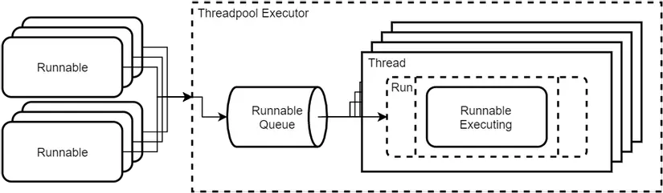

# Java core

## SOLID
Single responsibility
- Your class or method should have only one responsibility
- Your class or method should have only one reason to change

Open/Closed Principle
- A class should be open for extension and closed to modification
- In simpler term, you should be able to add new functionality to a class without changing its existing code
→ Avoid introducing bugs to a working application

Liskov’s Substitution Principle
- A class should be able to be replaced with a subclass without causing any problems like throw exception
```
// Incorrect implementation 
public class Bird {
    public void fly() {
        // I can fly
    }

    public void swim() {
        // I can swim
    }
}

public class Penguin extends Bird {

    // Penguins cannot fly, but we override the fly method and throws Exception → violating LSP
    @Override
    public void fly() {
        throw new UnsupportedOperationException("Penguins cannot fly");
    }
}

// Correct implementation
public class Bird {

    // methods
}

public interface Flyable {
    void fly();
}

public interface Swimmable {
    void swim();
}


public class Penguin extends Bird implements Swimmable {
    // Penguins cannot fly, therefore we only implement swim interface
    @Override
    public void swim() {
        System.out.println("I can swim");
    }
}
```

Interface Segregation Principle
- Larger interfaces should be split into smaller ones
→ Ensuring that a class is not forced to implement methods it does not need

Dependency Inversion Principle

Violates DIP
```
class MySQLDatabase {
    public void save(String data) {
        System.out.println("Saving to MySQL");
    }
}

class UserService {
    private MySQLDatabase database = new MySQLDatabase();

    public void saveUser(String user) {
        database.save(user);
    }
}
```

Follows DIP
```
interface Database {
    void save(String data);
}

class MySQLDatabase implements Database {
    public void save(String data) {
        System.out.println("Saving to MySQL");
    }
}

class UserService {
    private final Database database;

    public UserService(Database database) {
        this.database = database;
    }

    public void saveUser(String user) {
        database.save(user);
    }
}
```

high-level modules shouldn't depend on concrete implementations, instead it should depend on abstractions to reduces coupling

## OOP

OOP is a programming method that's based on 2 important concepts: class and object. Class define attribute and method, and it's a prototype of an object

- Tính đóng gói (encapsulation): allow restrict direct access to internal state to protect data
  Real scenario: to protect business rule
  ```
  public void setStatusCancel() {
    if (this.status != CREATED) {
        throw new BusinessException("Cannot cancel");
    }
    this.status = CANCELLED;
  }
  ```
- Tính kế thừa (inheritance): allow a class to inherit all methods and attributes of parent class to reuse code and create hierarchy structure
- Tính đa hình (polymorphism): allow different objects perform the same action with different implementation (only for method, not field)
  ```
  class Parent {
      String name = "Parent";
  }

  class Child extends Parent {
      String name = "Child";
  }

  class ParentExample {
      public static void main(String[] args) {
          Parent obj = new Child();
          System.out.println(obj.name); // Parent
      }
  }
  ```
- Tính trừu tượng (abstraction): allow define abstract method and class to hide internal implementation

```
abstract class Vehicle {
    private String brand;   // Encapsulation (đóng gói)

    public Vehicle(String brand) {
        this.brand = brand;
    }

    // Getter + Setter (đóng gói)
    public String getBrand() {
        return brand;
    }

    // Abstract method (trừu tượng)
    abstract void drive();
}

class Car extends Vehicle {
    public Car(String brand) {
        super(brand);
    }

    @Override
    void drive() {  // Polymorphism
        System.out.println(getBrand() + " car is driving on the road.");
    }
}
```

access modifier:
- public: accessible everywhere
- protected: accessible within subclass or class under the same package
- package-private (default when no access modifier): accessible within class under the same package
- private: only accessible within that class

## Data type
2 primary data types:

8 primitive data type:
- byte (0)
- int
- long
- short
- double (0.0d)
- float (0.0f)
- boolean: false
- char

reference data type not store value directly but store memory address where value is stored: class, interface, array, enum

autoboxing is transform primitive type to wrapper class: Integer i = 1

unboxing is transform wrapper class to primitive type: int i = new Integer(1)

both double and float represent decimal number, but double represent more precisely 8 byte, float 4 byte

## Exception
exception is unexpected behavior that crash program, 3 types:
- checked exception: happen at compile time, it's already predicted by program and forced to handle, for example IOException, SQLException
- unchecked exception: happen at runtime, it's usually programming fault like 0 division, which cause ArithmeticException or NullPointerException
- error: is serious error that's out of developer control like OutOfMemoryError, StackOverflowError

Throws: declared in the method signature to define that a method can throw 1 or more exception. when that method is called, we have to handle these exception
```
public void myMethod() throws IOException, SQLException {
    // can throw IOException hoặc SQLException
}
```

## Interface

Interface is a collection of abstract method used to define the behavior that implement class can perform, it can contain field but java automatically mark these field as static and final

Marker interface is empty interface used to provide information for JVM, like Serializable

### Interface vs abstract class

regarding technical syntax
- interface can only contain static final variable, while abstract class can contain any kind of variable
- 1 class can only extend 1 abstract class but can implement multiple interface

and regarding usecase, it's more about code management, like abstract class used to share base common field and method, while interface used to define contract that all the implement class must follow

### Functional interface

Functional interface is an interface that may contains default, static methods but only 1 abstract methods to enables lambda expressions. Several built-in functional interfaces:
```
Function<String, Integer> length = s -> s.length();
System.out.println(length.apply("Kelvin")); // 6

Predicate<Integer> isEven = n -> n % 2 == 0;
System.out.println(isEven.test(4)); // true

Consumer<String> printer = s -> System.out.println(s);
printer.accept("Hello");
```

## Anonymous class

anonymous class is a class without a name, declared and initialized in one place to override methods or provide implementation on the fly

In an anonymous class, this refers to the anonymous class instance, while in a lambda, this refers to the outer class because lambda does not create a new scope

## equals vs ==
== is used for primitive type to compare value directly, if it's used for object, it will compare reference, which mean it's checking if 2 object pointing to the same memory address

equals is a method of an object and it can be override to custom logic to compare. For example, String override method equals to compare content value

Note that == can be used for enum because each enum constant is unique

## Comparable vs Comparator
Comparable is implement by an object to compare with another object, override method compareTo(Object o)

Comparator is implement to compare 2 object, override method compare(Object o1, Object o2)

## String

String Pool is a special area in heap that stores unique string literals to reduce memory usage by reusing reference for String object with the same content

`intern()` return reference of equal object if exist in the String Pool, otherwise add it

```
String a = "hi";
String c = "hi" // Reuse from pool
String b = new String("hi"); // Always create new object in heap, not reused from pool

System.out.println(a == b); // false
System.out.println(a == b.intern()); // true
```

String vs StringBuffer vs StringBuilder:
- String is immutable, so when we update content, we are creating a new String object. StringBuilder and StringBuffer are mutable but StringBuffer thread-safe (String is immutable so it's always safe)
- If we need to update content a lot, StringBuilder is fastest because there is no synchronization cost

## BigDecimal

float and double are actually approximate, which can produce precision error like double 0.1 + 0.2 = 0.30000000000000004 != 0.3

Always init with string new BigDecimal("0.1"), if need to use double, use BigDecimal.valueOf(0.2) for safe

Use compareTo() for comparison and other util function like negate(), add(), subtract(), ...

Internally, BigDecimal uses two primary components, Unscaled value which is BigInteger that represent the significant digits and scale represents the number of digits to the right of the decimal point. For example, 1.1 is stored as 11 for unscaled and 2 for scale 

## Collection
Iterator is an interface that provide method to iterate through elements of a Collection like next, hasNext, remove

root interface is Collection and other subinterface with implementation:
- List: LinkedList, ArrayList
- Set: HashSet, TreeSet
- Queue: ArrayDeQue, PriorityQueue
- Map: HashMap, LinkedHashMap, TreeMap

Array vs ArrayList:
- ArrayList can only store object, while Array can store both object and primitive type
- Array is faster because of fixed size, ArrayList is slower because maintain dynamic size and complex methods

LinkedList vs ArrayList:
- ArrayList access element based on random index faster, but write slower because need to move elements
- LinkedList access element based on random index slower because need to iterate through node, but write faster because just need to update pointer
- ArrayList manage memory more efficient because it use dynamic size that shrink up or down based on number of element, LinkedList use more memory to maintain pointer between nodes

HashSet vs TreeSet:
- HashSet not maintain order, while TreeSet maintain asc or desc order based on constructor parameter
- HashSet allow 1 null value while TreeSet need custom Comparator to allow

HashMap vs TreeMap vs LinkedHashMap:
- HashMap not maintain order, TreeMap maintain asc or desc order, LinkedHashMap maintain insert or access order based on constructor parameter

HashCode is a method that return integer. It's used to calculate hash value when working with data structure that based on hash table so we need to override both equasl and hashCode method together so that 2 equal object have the same hash value, otherwise they will be treated as 2 different element when stored in data structure that based on hash table

how HashMap work: 
- when add 1 pair of key value, HashMap use hashCode method to get hash value, this value represent position of that entry in hash table, which is also known as bucket
- when get we use the same process, get hash value from hashCode to know bucket and go straight forward to that bucket
- when different key have the same hash value, HashMap will store entries as LinkedList within a bucket and if the number of element exceed threshold, it transform to balanced tree
- If such collision situation, HashMap iterate through element and use equals method to get or find if key already exist when put
- HashMap allow 1 null key and it's stored at first bucket: bucket0

HashMap resize when size exceed load factor of capacity, and it downgrade performance because entire map is rebuilt, so every existing key must recalculate hash code to determine new bucket position

## Serialize

Serialize used to transform object into a format that can save into file, database or pass through network under byte array. Deserialize is vice versa

Mark sensitive field that we dont want to serialize as transient. Miss match version can cause deserialize unsuccessful

## Reflection

Reflection is a feature that allows:
- Inspect classes, methods, fields, and constructors at runtime
- Access and manipulate private fields and methods
- Dynamically create objects and invoke methods

Provide flexibility but
- slower than direct method calls or field access
- potentially exposing sensitive data because can bypass access modifiers
- make the code harder to read and debug

Sample: 
- Spring use reflection to inject dependencies at runtime by inspecting classes and reading annotations like @Autowired then inject
- Hibernate uses reflection to map java objects to database tables by inspecting classes and reading annotations like @Column for mapping information. It also inspect object's fields to generate corresponding SQL INSERT or UPDATE statements

## Stream api

Stream API is a feature that provide modern, functional-style approach to process sequences of elements such as collections, arrays using operations like filter, map, and collect

A stream does not store data but it is a pipeline where data flow with 3 parts:
- Source: like myList.stream()
- Intermediate operations: operations that return a new Stream object like filter, map, sorted. They are lazy
- Terminal operation: operation that triggers the actual execution of the entire pipeline and produces a final result like forEach, collect, count

Cannot resuse stream object even not call terminal operation yet, have to recreate source 

## Multi-threading

2 ways to create thread in java
- Creaete a class that extend Thread and override method `run()` to define task logic. To execute this task, initialize object then call method `start()`
- Create a class that implement Runnable and override method `run()` to define task logic. To execute this task, init runnable object, then init thread object with runnable object as constructor parameter, finally call method start()

java will allocate resource and run in a seperate thread. If call method `start()` more than once, java throw IllegalThreadStateException. If call method `run()` directly, it will be executed on current thread

Runnable is prefer because it seperate task definition from task execution and compatible with threadpool
```
CustomRunnable customRunnable = new CustomRunnable();
Thread thread = new Thread(customRunnable);
thread.start();
```

Callable like Runnable but override method `call()` instead of run() and it does return value or throw checked exception
```
ExecutorService executorService = new ForkJoinPool();
Future<String> future = executorService.submit(new CustomCallable());
String result = future.get();
```

Threadpool used to limit number of thread at one time, inside it is a queue. When all threads are busy, submitted tasks are placed into this queue and executed when a thread becomes available.

When we create threadpool in java, we usually config core pool size, max pool size and queue capacity. It work like this, for example core pool size is 2 and max pool size is 10, when 10 task come at the same time, java will not use 10 but only 2 threads to handle task and the remaining will go to queue. java only create more thread when queue capacity is full

If all thread are busy with max pool size reached and queue capacity is full, reject policy is applied. Implement RejectedExecutionHandler to custom logic or use 1 of 4 built-in policies: AbortPolicy (throws exception), CallerRunsPolicy (runs task in caller thread), DiscardPolicy (drops task silently), and DiscardOldestPolicy (remove oldest and retry submitting). CallerRunsPolicy is often preferred to avoid losing task



Never create raw thread with `new Thread()` in production, always use ExecutorService for threadpool.

Never use newFixedThreadPool() because internally it use a runnable queue with unlimited size, so the queue can be grow until JVM memory is exhausted, whichs cause OOM

When ExecutorService submit a callable, it return a Future, call method get() to block current thread until result is returned. This has several disadvantages like not support built-in exception handling, cannot catch event after task done, ...

→ CompletableFuture:
- Task chaining: thenApply(result -> result + 1), thenAccept(result -> logger.info(result))
- Built-in exception handling: exceptionally()
- Combine multiple tasks: allOf, anyOf

when config thread pool, return DelegatingSecurityContextAsyncTaskExecutor so that thread contain security context if need

Tomcat follow a thread-per-request model, so can config server.tomcat.threads.max=200, but be aware that if tomcat thread larger than db connection, they have to compete and wait

### Lifecycle

NEW → RUNNABLE → (BLOCKED/WAITING/TIMED_WAITING) → TERMINATED
- NEW: Thread is created `new Thread()`, but `start()` not called yet
- RUNNABLE: After calling `start()`. Thread is ready or running (JVM scheduler decides).
- BLOCKED: Waiting to acquire a lock, for example entering a `synchronized` block
- WAITING: Waiting for another thread to perform an action, for example `sleep()`, `wait()`, `join()`
- TERMINATED: `run()` method finished or thread died due to exception

join() method is used to pause the current thread until the target thread complete. Calling join() on a thread that not started yet will return immediately without waiting

wait() can only be used within a synchronized block and usually pair with notify() for inter-thread communication. When a thread calls obj.wait(), it immediately release monitor lock and suspend execution until another thread calls notify() on the same object

## Thread-safe type

A thread-safe type is a class or data structure that can be safely used by multiple threads at the same time without causing data problems like race condition

In Java, we achieve thread safety using synchronization, atomic classes, concurrent collections or immutable objects

### ConcurrentHashMap

ConcurrentHashMap is thread-safe for individual operations but not for multi-step operations, For example

Check-then-action
```
if (!map.containsKey("a")) {
    map.put("a", 1);
}

=> map.putIfAbsent("a", 1);
```

Read-modify-write
```
map.put("count", map.get("count") + 1);

=> map.compute("count", (k, v) -> v == null ? 1 : v + 1); || map.merge("count", 1, Integer::sum);
```

This is tradeoff, internally they use Compare-And-Swap and fine-grained locking to avoid global locking, which improve performance but requires developers to use correctly when dealing with compound logic

Compare-And-Swap is a lock-free mechanism where a thread updates a value only if it hasn’t been changed by another thread. Internally, it use a do-while loop to compare and set until successful

Fine-grained locking is lock only a small part instead of locking the entire structure

ConcurrentHashMap use CAS when there is no contention like bucket is empy, and use fine-grained lock when there is contention

### CopyOnWriteArrayList

CopyOnWriteArrayList is a thread-safe list where all write operations create a new copy. To be more specific, when writing it lock then copy entire array then modify the copy then replace old reference with new reference and old array is discarded later by GC. So only one thread can modify at a time and readers can access immutable snapshot. It is only suitable for read-heavy case because write operations are O(n)

CopyOnWriteArrayList also provides snapshot-based iteration, meaning when an iterator is created, it captures a reference to the current state of the underlying array. Any subsequent modifications create a new array, so the iterator continues to operate on the old snapshot. This avoids ConcurrentModificationException but the iterator does not reflect any updates made after its creation

### synchronized

synchronized is built-in, automatically acquires lock when enter block and releases lock when exit block 

synchronized uses a monitor lock associated with every object

For instance methods or blocks, it locks the current object, so that obj1.method() and obj2.method() can run at the same time, while obj.method1() and obj.method2() is not

For static methods or blocks, it locks the Class object, obj1.method() and obj2.method() cannot run concurrently

```
synchronized (this) {
    // only 1 thread at a time
}
```

### ReentrantLock

ReentrantLock from java.util.concurrent.locks, must manually lock() and unlock(), support advanced features like timeout

```
Lock lock = new ReentrantLock();
lock.lock();
try {
    // task
} finally {
    lock.unlock();
}
```

### ConcurrentHashMap vs synchronizedMap

Both are used when multiple threads modify a shared map. synchronizedMap use 1 big lock so only one thread can access at a time, while ConcurrentHashMap does not lock the entire map, instead it lock at bucket level when needed

## JVM

Architecture of jvm and how it works

## Garbage collector

When init a variable, java allocate memory for it, when there is no more reference to that variable, it can be clean up by garbage collector to release memory. Not immediately, it depend on gc's algorithm and other aspect such as remaining memory in heap, ...

Several types: 
- Serial GC: single-threaded, suitable for small applications
- Parallel GC: multi-threaded, suitable for high throughput

We can custom behavior before clean up by override method finalize

### Stack vs heap

Both stack and heap are used for memory management during program execution. However, stack stores local variable and method execution, while heap stores objects. Stack does store object but only object reference, while heap store actual object

## Other

JRE is java running environment, JDK is a development kit to develop java application, JDK contain JRE

A managed language like Java have pros and cons such as provide automatic memory management, faster development but whenever garbage collector do the clean up, it's like a stop-the-world event and can cause latency

Java is both a compiled and an interpreted language:
- compile: Java source code (.java file) is first translated into bytecode (.class file) by the javac compiler
- interpret: JVM acts as an interpreter by translating the bytecode into native machine code at runtime

Java always use pass by value, which is copy value of variable. For object, passed value is copy of reference, so update of object's attribute inside function also take effect outside. This create a similar feeling of pass by reference
```
public static void changeName(Person p) {
    p.name = "Kelvin";
}

public static void changePerson(Person p) {
    p = new Person();
    p.name = "Alice";
}

public static void main(String[] args) {
    Person person = new Person();
    person.name = "John";

    changePerson(person);
    System.out.println(person.name); // John

    changeName(person);
    System.out.println(person.name); // Kelvin
}
```

cannot override private/static/final method

final method not allow to override and final class not allow subclass to extend

java not support extend multi class because of problems like 2 class have same method and java not require to override method, use interface instead

Use stream api when you want to improve readability with built-in function like collect, filter, map and use for loop when there is just a simple iteration or need control flow with break, continue

variable scope:
- local variable: declare inside method, accessible within that method
- instance variable: declare inside class but outside method, accessible within that class's methods
- static variable: declare inside class but outside method with static keyword, accessible within that class's methods and outside class through class's name if not private, for example ClassName.staticVariable
- global variable: java not have concept of global variable but we can use non private static as global variable

there is no such concept as static class but allow define nested static class

cannot access non-static variable inside a static context
```
public class MyClass {
    int myVar = 10;

    public static void myStaticMethod() {
        // System.out.println(myVar); // error

        MyClass myInstance = new MyClass();
        System.out.println(myInstance.myVar); // correct
    }
}
```

Enum is thread-safe

Profiling first, then optimize several aspects by choosing efficient data structures, improving concurrency with multi-thread and introducing caching with proper strategy

## Scenario Based Interview Questions

### Basic
difference between ++num and num++ ? 
what is the result ?
```
List<Integer> list = Arrays.asList(1, 2, 3);
for (int i = 0; i < list.size(); ++i) {
    int item = list.get(i);
    int num = item++ + ++item;
    System.out.println(num);
}
```

Why
```
Integer a = 1000;
Integer b = 1000;
System.out.println(a == b); // false

Integer x = 1;
Integer y = 1;
System.out.println(x == y); // true
```
→ Integer is object so compare using '==' is actually checking are these two variables pointing to the exact same object in memory

Java maintains a cache of Integer objects from -128 to 127 because small numbers are used all the time (loops, array indices, counters) → java hands x and y the same cached Integer instance

3 ways to exit nested loop:
- flag
  ```
  boolean flag = true;
  for (int i = 0; i < 10 && flag; i++) {
      for (int j = 0; j < 10; j++) {
          if (/* điều kiện thoát */) {
              flag = false;
              break; // Thoát khỏi vòng lặp nội bộ
          }
      }
      if (!flag) {
          break;
      }
  }
  ```
- label
  ```
  outerLoop: // Nhãn cho vòng lặp ngoài
  for (int i = 0; i < 10; i++) {
      for (int j = 0; j < 10; j++) {
          if (/* điều kiện thoát */) {
              break outerLoop; // Thoát khỏi cả hai vòng lặp
          }
      }
  }
  ```
- return

### OOP

What's printed ?

```
class Parent {
    String name = "Parent";

    public Parent() {
        printName();
    }

    public void printName() {
        System.out.println("1. Name in Parent: " + name);
    }
}

class Child extends Parent {
    String name = "Child";

    public Child() {
        System.out.println("2. Child Constructor finished");
    }

    @Override
    public void printName() {
        System.out.println("3. Name in Child: " + name);
    }
}


class ParentExample {
    public static void main(String[] args) {
        Parent obj = new Child();
        System.out.println("4. Reference name: " + obj.name);
    }
}
```

Why Doesn’t This Throw NullPointerException?
```
class Demo {
    static void show(){
        System.out.println("Hello Java");
    }
}

public class Test {
    public static void main(String[] args){
        Demo obj = null;
        obj.show();
    }
}
```

→ Static methods belong to the class, not the object so internally compiler convert to Demo.show()

2 interface have the exaclty similar abstract method, if a class implement these both interface, it can implement 1 method for both

Bonus: If both or 1 of both are default method, must explicitly implement and can optionally use `InterfaceName.super.method()`

2 interface have the same method name cannot have different return type

### Stream API
convert list to map using stream api, if there is key conflict ?

→ Use merge function
```
List<MyObject> list = Arrays.asList(
    new MyObject("A", 1),
    new MyObject("B", 2),
    new MyObject("A", 3) // Duplicate key "A"
);

Map<String, Integer> map = list.stream()
    .collect(Collectors.toMap(
        MyObject::getKey,
        MyObject::getValue,
        (existingValue, newValue) -> existingValue // merge function
    ));
// Result: {A=1, B=2}
```

Note: cannot stream on char[]

Find out the count of every Character in the given String? "abcdabcghsk"

List all the duplicate Characters in the String? programming

Delete all the occurrences of ‘c’ from the given String and print the String? occurance

Reverse a string
```
String str="javastreamsapi";
```

Given a sentence as a String, return the second-highest distinct word length present in the sentence
```
String sentence="I am working in motivated organization"
```

Merge Two Lists by Stream
```
List<Integer> list1= Arrays.asList(1,2,3,4);
List<Integer> list2= Arrays.asList(5,6,7,8);
```

Find out the even Integers ?
```
List<String> list = Arrays.asList("one","5","ab12","abc","8","20");
```

Given a list of strings, count how many times each word appears
```
List<String> words = Arrays.asList(
        "apple", "banana", "apple", "orange", "banana"
);
```

Given a list of employees,

find the third-highest salary among employees belonging to the ‘Engineering’ department

Highest-paid employee per department
```
class Employee {
    private String name;
    private String department;
    private int salary;
    private int age;

    public Employee(String name, Department department, double salary) {
        this.name = name;
        this.department = department;
        this.salary = salary;
    }
    public String getName() { return name; }
    public Department getDepartment() { return department; }
    public double getSalary() { return salary; }
}


List<Employee> employees = Arrays.asList(
        new Employee("Aman", "Engineering", 90000),
        new Employee("Riya", "Engineering", 80000),
        new Employee("John", "HR", 70000),
        new Employee("Sara", "Engineering", 75000),
        new Employee("Jim", "Engineering", 70000)
);
```

### Multithreading

scenario: one thread that updates the latest price into a field and multiple worker threads just read that value
```
private double latestPrice;
```

one writer, many readers but why workers sometimes read older prices even though a new price is already updated ? 

→ the problem is **visibility**, not concurrency.

Writer thread may update the value only in its CPU cache, and might not push it to main memory immediately. Meanwhile, reader threads may read an older value from their own cache

Java Memory Model doesn’t guarantee visibility unless we use:
- volatile
- synchronized
- Atomic field types
- ...etc

→ Fix: make the field volatile
```
private volatile double latestPrice;
```

volatile used to mark a variable as it can be modified by different threads at the same time, so write operation will force data to main memory and read operation will force CPU to fetch latest value from memory

In case not just price, but also another field that must always be consistent (like can’t read a new price but an old timestamp, or vice-versa), 2 separate volatile variables are unsafe because update of price + timestamp is not atomic

→ Define single immutable object
```
class PriceData {
    final double price;
    final long timestamp;
    PriceData(double p, long t) {
        price = p;
        timestamp = t;
    }
}
```
Then 
```
private volatile PriceData latest;
```

The object is immutable → so no one can partially modify it


Why Does This Thread Never Stop?
```
class Worker {
    boolean running = true;
    void work() {
        while(running){

        }
    }
}
```

Even another thread stop it with `worker.running = false`, worker thread keeps reading the cached value because thread may store frequently used variables in its local CPU cache. This is a memory visibility problem. Mark variable running as volatile to fix