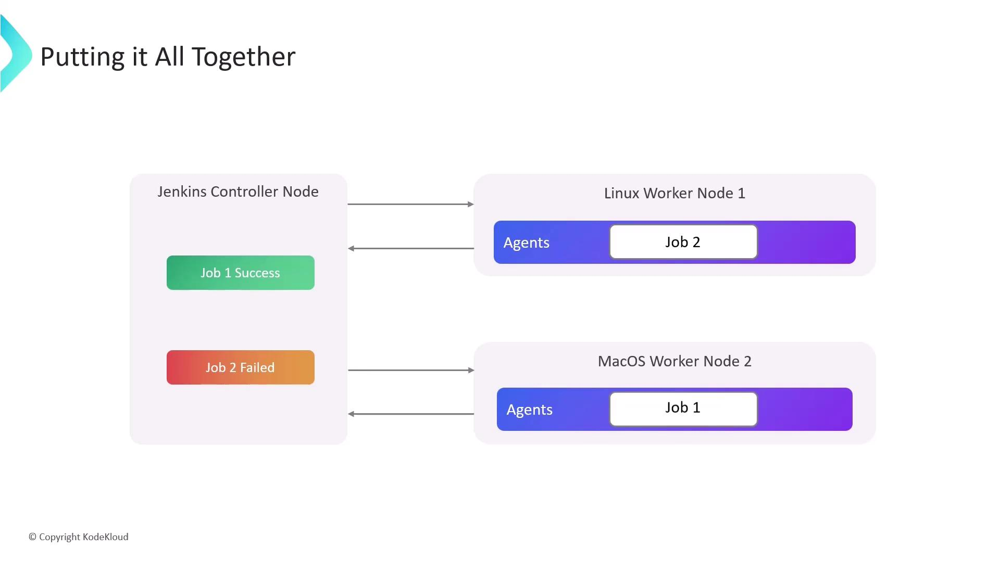

# Jenkins

## Core

Là automation server, detects the change every time a developer pushes code to a Git repository through webhook and run Jenkinsfile located in that repo.

Drawback: Self-hosting requirements (Unlike cloud-based CI/CD solutions like GitHub Actions or GitLab CI/CD), plugin management overhead, ...

## Architecture

- Jenkins server (Jenkins Controller or master node) is the central hub of your Jenkins installation that handle tasks like UI, plugin and user management, ...
- Jenkins agents are machines that execute jobs. These machines connect to the Jenkins Controller using protocols such as ssh or Java Network Launch Protocol
- Each node is allocated a set number of executors, which are threads that run jobs concurrently. The number of executors per node is determined by the node's available hardware resources
- Agents are worker processes running on a node that executes tasks delegated by the controller

## Projects

There are several types of project such as Freestyle, Pipeline, ... but only focus on Multibranch Pipeline.

Multibranch Pipeline: A repo with multi branch, each branch may have different Jenkinsfile, so Jenkins can execute different jobs based on each branch changes (Ex: prod, stg, dev)

## Plugins

Install plugins to extend capabilities in multiple areas, Ex: Notifications: Send real-time alerts through platforms like Slack when builds complete or fail

## Pipeline

Pipelines are defined using a Jenkinsfile

pipeline {
    agent any

    environment {
        IMAGE_NAME = "meikocn-api"
        TARGET_SERVER_PATH = "meikocn"
        AWS_ACCESS_KEY_ID = credentials('AWS_ACCESS_KEY_ID')
        AWS_SECRET_ACCESS_KEY = credentials('AWS_SECRET_ACCESS_KEY')
        AWS_REGION = credentials('AWS_REGION')
        S3_BUCKET_NAME = credentials('S3_BUCKET_NAME')
        DOCKER_USERNAME = credentials('DOCKER_USERNAME')
        DOCKER_PASSWORD = credentials('DOCKER_PASSWORD')
    }

    stages {
        stage('Checkout Code') {
            steps {
                checkout scm
            }
        }

        stage('Get short SHA') {
            steps {
                script {
                    SHORT_SHA = sh(script: "git rev-parse --short HEAD", returnStdout: true).trim()
                    env.IMAGE_TAG = "sha-${SHORT_SHA}"
                    echo "Image Tag: ${env.IMAGE_TAG}"
                }
            }
        }

        stage('Configure AWS CLI') {
            steps {
                sh '''
                    aws configure set aws_access_key_id $AWS_ACCESS_KEY_ID
                    aws configure set aws_secret_access_key $AWS_SECRET_ACCESS_KEY
                    aws configure set default.region $AWS_REGION
                '''
            }
        }

        stage('Download Config from S3') {
            steps {
                sh '''
                    mkdir -p src/main/resources
                    aws s3 cp s3://$S3_BUCKET_NAME/config/application.yaml src/main/resources/application.yaml
                '''
            }
        }

        stage('Docker Login') {
            steps {
                sh '''
                    echo $DOCKER_PASSWORD | docker login -u $DOCKER_USERNAME --password-stdin
                '''
            }
        }

        stage('Build and Push Docker Image') {
            steps {
                script {
                    def imageFullName = "${DOCKER_USERNAME}/${IMAGE_NAME}:${IMAGE_TAG}"
                    echo "Building and pushing ${imageFullName}"
                    sh """
                        docker build -t ${imageFullName} .
                        docker push ${imageFullName}
                        docker logout
                    """
                }
            }
        }
    }

    post {
        always {
            slackNotifier(
                channel: '#your-slack-channel',
                message: "${currentBuild.result}"
            )
        }
        // or
        success {
            echo "✅ Build and push succeeded!"
        }
        failure {
            script {
                // Send failure notification
            }
        }
    }
}

### Agent 

Some samples:

- any: will run on any available Jenkins agent, including the controller
- label-based: target nodes matching a label
  
  agent { label 'meikocn' }
  
- docker: containers created from custom images, destroyed after each build
  
  agent {
    docker {
      image 'node:latest'
    }
  }
  
  Every stage executes inside the same container. Artifacts created in one stage remain available in the next -> use newContainerPerStage to enforcing stage isolation
  
  agent {
    docker {
      image 'node:latest'
    }
  }
  options {
    newContainerPerStage()
  }
  