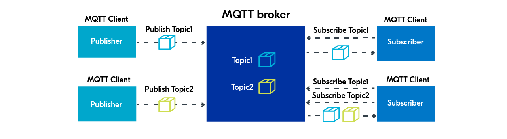

# Protocol 

## MQTT (Message Queuing Telemetry Transport)

Is pub-sub network protocol that consists of a message broker and multiple clients

MQTT broker (message broker) is server that receives messages from pub clients and routes them to sub clients

Multiple clients can be subscribed to a single topic, and a single client can be subscribed to multiple topics, so how message is distributed ?

- Normal subscriptions: all subscribers receive a copy
- Shared subscriptions (introduced in MQTT 5.0): evenly distribute message among clients, which mean one message delivered to only one client

MQTT protocol has a keep-alive function to ensures connection between broker and client. We can specify keep-alive interval in client side or broker side when connecting, which is the maximum time that broker and client can go before the connection is closed.

When connecting to broker, client can specify quality of service (QoS):
- At most once: message is sent only once.
- At least once: message is re-tried by sender multiple times until acknowledgment is received.
- Exactly once: sender and receiver engage in a two-level handshake to ensure message is received only once.

## RPC (Remote Procedure Call)

is communication method that allows a program to execute a procedure or function on a remote computer as if it were a local call

## Websocket

Is protocol enables ongoing, bidirectional communication between servers and clients

WebSocket protocol consists of an HTTP opening handshake to upgrading the connection from HTTP to WebSockets, after successfully negotiate the opening handshake, the WebSocket connection acts as a channel where each side can independently send data

        ┌──────────┐                    ┌──────────┐
        │  Client  │                    │  Server  │
        └────┬─────┘                    └────┬─────┘
             │                               │
             │      Initial HTTP             │
             │       handshake               │
             ├──────────────────────────────►│
             │◄──────────────────────────────┤
             │                               │
             │      WebSockets               │
             │◄─────────────────────────────►│
             │                               │
             │         Close                 │
             ├──────────────────────────────►│
             │◄──────────────────────────────┤

schemes: ws