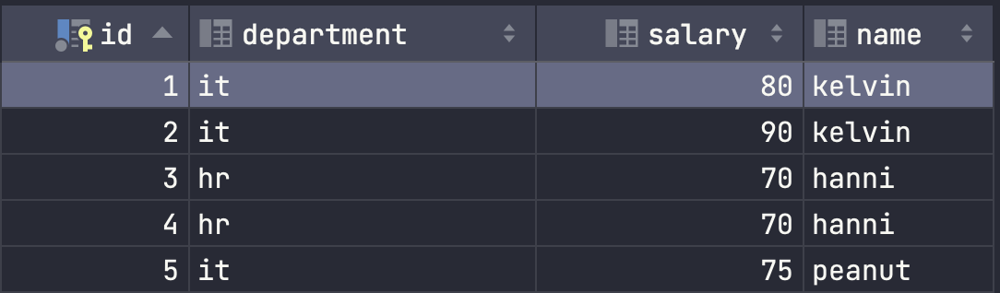

# SQL

from/join
where
group by
having
select
distinc
order by
limit/offset

## Scenario Based Interview Questions

Given 2 tables like this:

users
| Column   | Type     | Description      |
| -------- | -------- | ---------------- |
| user_id  | INT (PK) | Primary key      |
| name     | VARCHAR  | Name of the user |

orders
| Column      | Type     | Description                     |
| ----------- | -------- | ------------------------------- |
| order_id    | INT (PK) | Primary key                     |
| user_id     | INT (FK) | Foreign key referencing `users` |
| order_date  | DATE     | Date of the order               |
| amount      | DECIMAL  | Order amount                    |

Propose index solution to improve this query:
select user.name, TOCHAR(order.order_date, yyyy-mm) as month, sum(order.amount) as total_amount 
from users user join orders order on user.user_id = order.user_id
group by TOCHAR(order.order_date, yyyy-mm), user.user_id
order by month desc

Sample results:

id, month, total_amount
kelvin, 2025-12, 10
kelvin, 2025-11, 9
alice, 2025-12, 10

we should add composite index of user_id and order_date for table orders, because:
- Join optimization: index user_id will speeds up the lookup of related orders for each user
- Grouping optimization: index order_date will group data more efficiently after filtering by user_id
- Index scan range: The composite index allows a range scan on user_id, then efficiently accesses order_date

### Find customers who never placed an order
most common answer:
```
SELECT * FROM customer
WHERE id NOT IN (SELECT customer_id FROM orders);
```
if orders.customer_id have any null value, it will fail because
Standard comparison operators (like =, <>, IN, NOT IN) return UNKNOWN when compared with a NULL value

correct
```
select * from users left join orders on users.user_id = orders.user_id where orders.user_id is null
```

Given a table like this:



### Find the second highest salary in each department
DENSE_RANK is a SQL window function that assigns a rank to each row within a result set, where tied values receive the same rank, and no ranks are skipped in the sequence
```
select * from (
    SELECT *, DENSE_RANK() OVER (
        PARTITION BY department
        ORDER BY salary DESC
    ) AS rank
    FROM employee
) t where rank = 2
```
- OVER(): mandatory clause for all window functions
- PARTITION BY: optional clause divides the rows into partitions and restart the ranking in each new partition
- ORDER BY: mandatory clause


### Remove duplicate rows but keep one (or how to find duplicate row)
clarify:
- What defines duplicate (name only or multiple columns)
- Which one to keep (min ID or latest created)

use a window function like ROW_NUMBER() partitioned by the duplicate columns, then delete rows where row number > 1

```
delete FROM employee WHERE id IN (
    SELECT id FROM (
        SELECT *, ROW_NUMBER() OVER (
                   PARTITION BY name, department
                   ORDER BY id
               ) AS rn
        FROM employee
    ) t WHERE rn > 1
);
```

→ ROW_NUMBER() assigns a unique, sequential integer to every row, ignoring ties, while DENSE_RANK() assigns the same rank to ties and never leaves gaps in the ranking sequence. RANK() is similar to DENSE_RANK() but create gap ((e.g., 1, 2, 2, 4))

## Index
Cơ chế hoạt động của hash index: khi lưu record, dùng hàm băm để tính giá trị băm của primary key sau đó lưu vào bảng băm. Bảng băm cho phép truy cập nhanh đến địa chỉ lưu trữ của bản ghi thực tế

## Other
bảng tạm bảng dc sinh ra để lưu kết quả tạm trong quá trình thực hiện 1 câu truy vấn

view là bảng ảo dùng để lưu kết quả câu truy vấn

diffence between DDL and DML: DDL (Data definition language) dùng để define cấu trúc của 1 cơ sở dữ liệu như các lệnh create update table, DML (Data manipulation language) dùng để thao tác dữ liệu như insert, update

diffence between union and join: union trả về 2 data set từ 2 table trong khi join trả về 1 data set gồm nhiều column từ nhiều table

diffence between union and union all: union detect duplicate bằng cách so sánh kiểu dữ liệu và content của toàn bộ column và chỉ return distinct trong khi union all trả về toàn bộ

diffence between where and having: having chỉ được dùng khi có group by, và có thể dùng với các aggregrate funtion như min, max, sum, avg, ...

all types of join

while sql utilize its acid for finance/banking, nosql usually used for:
- E-commerce Product Catalogs: handles various product attributes, allowing frequent updates without schema downtime
- Real-time Analytics or Data Logging: store and analyze massive volumes of data