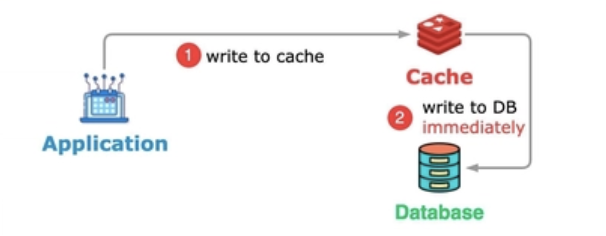
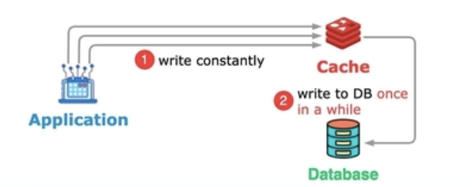
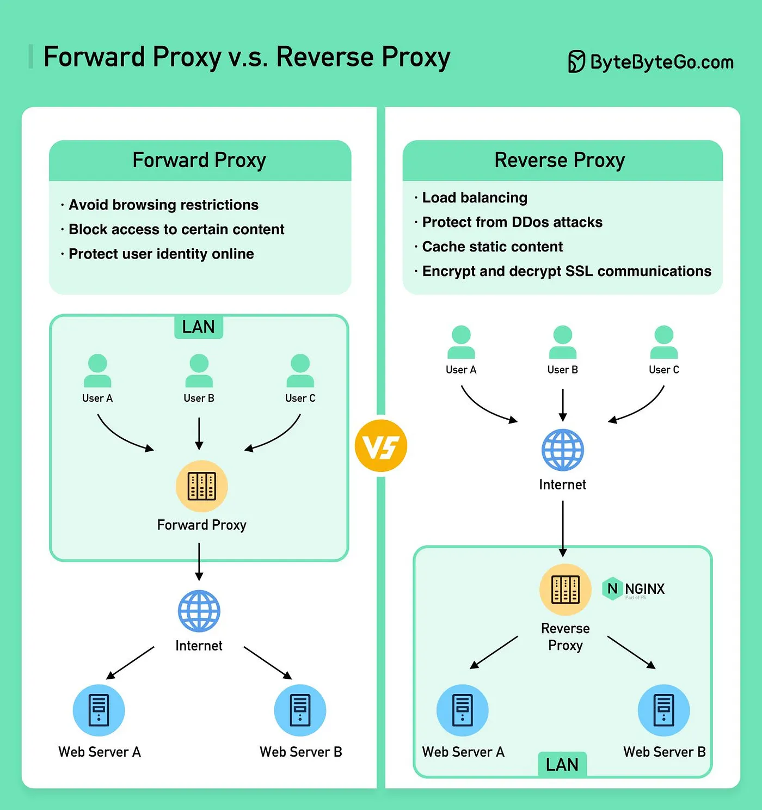

# System design

## Design real-time leaderboard car bidding to show top 10 for 1M users
Problem statement:

A vehicle bidding platform where users engage in session to bid for car. When a session start, the platform intends to show the top 10 bidders, with their rankings determined by their bidding data on the Leaderboard. System need to be reliable when the marketing team launch some campaigns to like reward secret gift for winner users

Total active users: 50 million
Daily active users: 10 million
active users per session: 500k but when marketing team start the campaign, traffic would be higher than usual, maybe 1M
Leaderboard update frequency: real-time or near real-time
Data consistency requirement: eventual consistency is acceptable
Display focus in the user interface: only the top 10 users and their ranks

DB design: PostgreSQL with 2 tables user and user_bidding. The user_bidding table record the bidding data of users (money, timestamp), while the users table holds information related to user profiles. When user bid first time or rebid in the same session, a new record is insert into user_bidding

Redis SortedSet (collection of unique strings ordered by an associated score):
- Use string as userId and associated score as bidding money
- Use ZADD command to add a new user with score or update score if already exists (ZADD leaderboard-car123 100 kelvin123). O(log(N)) with N is total number of elements
- Use ZRANGE command to query. Collection is sorted in ASC default, so we use REV keyword to reverse (ZRANGE leaderboard-car123  0 9  WITHSCORES REV). ZRANGE use zero-based indexes so 0 is the first element. O(log(N)+M) with N is total number of elements and M is number of elements returned.

Serivce interaction design with websocket, rabbitmq, postgre and redis sorted set:
- Bước 1: save bid data vào postgre db và publish 1 cái message vào queue để update tiền bid xe trong redis sorted set using zadd command
- Bước 2: Sau khi update redis sorted set xong thì tiếp tục publish message cho consumer của bên leaderboard để check leaderboard có thay đổi hay k using zrange command, nếu có thì cache leaderboard sau khi dc thay đổi và broadcast thay đổi đó tới websocket (dùng STOMP). Ở bước này trước khi check sự thay đổi của leaderboard thì mình có implement 1 cơ chế throttle để quản lý tần số thay đổi leaderboard vì lỡ như 1 giây có 1000 request bid cùng lúc thì k lẽ mình để UI update 1000 lần trong 1s là k hợp lý. Mình check từ thời điểm gần nhất mà leaderboard dc update đến hiện tại phải cách ít nhất nửa giây thì mới check leaderboard có thay đổi hay k.
- Bước 3: sau khi broadcast thay đổi của leaderboard tới websocket thì FE nhận data từ socket rồi update lại UI thoi

## Deployment strategy

- Blue-Green: Maintain 2 similar environment but different code version, for example Blue with old version and Green with new version. After being tested thoroughly, we can update load balancer or api gateway to route traffic to Green
- Rolling update: Update each instance until the whole cluster use same new version. This save resource as it does not need to maintain 2 env like Blue-Green. Popular like k8s behavior, update image and k8s will gradually replace old pod with new pod 
- Others: Canary (release the new version to a small percentage of users first), Recreate (Low complexity but have down time), ...

## Caching strategy

3 level caching: client, server, db (Frequently queried db results)

below 'db' actually represent underlying storage, not restrict to only db but maybe data from 3th party

- Cache-Aside (lazy loading): application checks the cache first; if data is missing, it fetches it from db, updates the cache, and returns it. Ideal for read-heavy applications because cache always miss first request but rarely for later request
- Least Recently Used (LRU): evicting the one that hasn't been used for the longest time (requires usage tracking) prioritizing frequently accessed data to improve hit rates
- Most Recently Used (MRU): evicting the one that has been used most recently (requires usage tracking)
- First-In-First-Out (FIFO): evicts the oldest data added to the cache, regardless of how often it is accessed
- Random Replacement: randomly selects an item for eviction (simple but not optimal)

caching invalidation strategies (removes or updates cache entries when the corresponding data in db changes)
- Write-Through: data is written to both the cache and db almost simultaneously (cache is always up-to-date but increase write latency)

  
- Write-Back: data is written to cache immediately, and the update to db is deferred (reduces write latency but risk of data loss)

  

## Message queue vs pub-sub vs message broker

Message queue is point-to-point messaging pattern, producer send 1 message to 1 queue and multiple consumer compete to consume it only once. For example, aws sqs or rabbitmq with queue mode

Pub-sub is broadcast messaging pattern, publisher send 1 message to 1 topic and multiple subscribers receive a copy. For example, redis pub-sub, gg pub-sub, consumer group in kafka

Message broker is software system that implements messaging patterns like message queue, pub-sub, routing, retry, ... For example, rabbitmq, kafka, pulsar

So both message queue and pub-sub are messaging patterns, while a message broker is the system that implements those patterns

## Forward proxy vs reverse proxy

Forward proxy is a server that sits between client and the internet, it's typically used to control access to the internet

Reverse proxy is a server that sits between client and origin server

## Partitioning vs sharding

Partitioning splits a large table into smaller pieces inside the same database instance, while sharding splits data across multiple database servers. Although sharding scale horizontally, it add complexity for cross-shard joins or distributed transaction

## Process vs Thread

A process is an independent program with its own memory, while a thread is an execution unit inside a process. So a process can contain multiple threads and they share memory

## Context switching

When the number of thread is larger than number of cpu, os need to do context switching, which is save state of thread A, restore state of thread B and resume execution, so it's actually time-slice but very fast that we feel like parallel.

Too many threads may reduce performance because it spends more time switching than doing real work

For cpu task like resize an image, sort a large array of data or do a complex calculation, number of thread shouldn't exceed number of cpu because cpu is always busy

For IO task like db call or api call, number of thread can larger than number of cpu because cpu is idle during waiting for external resources

blocking I/O means your code is waiting for an external event to complete before it can proceed

## Memory profiling

Memory profiling is analyzing heap usage, object allocation, and garbage collection behavior to detect memory leaks and performance issues. In springboot, we can use tools like Java Flight Recorder or Actuator metrics to monitor JVM memory

## Race condition

When multiple threads modify shared data without proper synchronization, which cause unpredictable results

## Deadlock

When two or more threads hold locks and wait for each other forever

## Distributed tracing

Distributed tracing tracks a request across multiple microservices using trace IDs and spans. Span represents a single operation (HTTP request = 1 span, DB query = 1 span), while a trace is a collection of spans that represent entire request journey

## Distributed lock

Applications often run behind k8s clusters with multiple replicas, so multiple instances may attempt to perform operations on the same resource simultaneously

### Redis-based

Acquire lock: SET lock_key unique_value NX PX expiration_milliseconds

— NX: set key if not exist
— PX: expiration to prevent deadlocks

Ex: SET payment_lock ca4492e5-6756-4d62-9717-9631982f8b22 NX PX 30000

Release lock: first check if it is still the holder of the lock, then deletes the key using the DEL command

This simple redis lock rely on a single Redis master instance => use Redlock Algorithm:

when a client attempts to acquire the lock, each instance send the SET command and the lock is only considered acquired if client successfully obtains it from a majority of the Redis instances (N/2 + 1)

To simplify the implementation of the Redlock algorithm, use Redisson library

### Zookeper-based

acquire lock: create znode under lock path

release lock: delete znode

Think of the lock path as a lock id

If a client crashes, its znode is auto-deleted, releasing the lock

## Exponential backoff

Exponential backoff is a retry strategy where the wait time between failed attempts increases exponentially rather than retrying immediately (1s, 2s, 4s, 8s, ...) . For example, allows time for recovery when encountering error rate-limiting (429)

## Circuit breaker

Circuit breaker is a resilience design pattern used to prevents additional load on the failing service. If the number of failures exceeds threshold within a time period, subsequent calls are automatically redirected to a fallback mechanism

Initially, allowing calls is closed state, then failure exceed threshold, transitions to an open state. After a period, circuit breaker enters a half-open state, where it allows a limited number of calls to the remote service to test if it has recovered

Use Resilience4j over Hystrix because it offer more features such as circuit breakers, rate limiters, retry mechanisms, and bulkheads

## Bulkhead

Bulkhead is a resilience design pattern used to limit resources allocated to a service, such as threadpool, db connection or concurrent call. This isolation ensures that a failure in one service does not overwhelm the entire system

## Saga with inbox/outbox pattern

Saga: Defines what needs to happen (the sequence of steps and compensations).
Outbox: Ensures how events are published reliably
Inbox: Ensures how events are consumed reliably (exactly once). 

### Saga pattern (Orchestrator)

A saga is a sequence of local transactions. Each local transaction updates the database and publishes a message or event to trigger the next local transaction. If a transaction fails, saga executes a series of compensating transactions that undo the changes that were made by the preceding transactions.

2 types:
- Orchestrator: have a centralized service knows the entire workflow and commands other services to act. Tight coupling. Best for complex workflows
- Event bus: services just subscribe to events and react. Loose coupling. Best for simple workflows

### Outbox pattern (sender side)

We can’t guarantee the atomicity of the corresponding database transaction and sending of an event, for example, if a service sends the event in the middle of transaction, there is no guarantee that the transaction will commit. Outbox pattern used to solve this dual writes problem.

Application stores event in outbox table instead of sending an event. When a service performs a business action, it writes the event to an outbox table in the same database transaction and a separate process (CDC) reads from this outbox table and publishes the message to a message broker. Upon receiving an acknowledgment from the broker, publisher update status of that record or just delete to maintain a small, high-performance table

### Inbox pattern (receiver side)

Listener receive published message will first save incoming message to its own inbox table, then a background process watch for this inbox table changes and handle the actual business logic

### Summary

Sample full flow: 
- Update entity as business logic and save event message to outbox table in the same transaction
- CDC Debezium capture changes in outbox table and publish message to kafka topic
- Message queue listener receive message will first store event message in inbox table
- Some process poll inbox table for new message and process it

The Outbox/Inbox patterns provide communication backbone that allows the Saga pattern to orchestrate complex workflows without losing messages or creating data inconsistencies

## Waterfall vs agile

Waterfall is sequential development model, while agile is incremental development model. So Waterfall already have a big plan at first, all requirements are defined early and changes are costly. In the contrast, agile not deliver the whole product at the end, but the development happens in small iterations called sprints, each sprint last for about 1-2 weeks to serve planning, developing and testing.

So for frequent release and continuous feedback, choose agile. For fixed requirement, choose waterfall

## Other

POST send 2 requests because browser send preflight OPTION request before the actual request to confirm whether the intended request is permitted