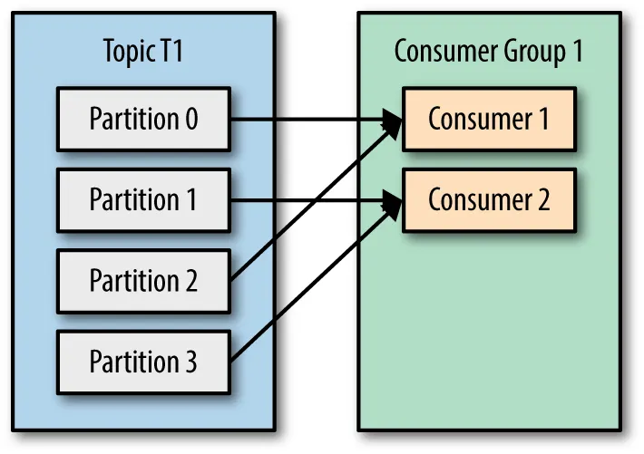

# Kafka

Kafka

## Core

Components: broker, producer, consumer, topic, partition, offset

Broker is a server which has Kafka running on. Multiple brokers would form a Kafka cluster

Imagine a library (Kafka topic) that stores books (messages). The library has several shelves (partitions), and each book needs to be placed on a shelf. Every message in a partition is assigned a unique ID known as an offset.

## Partition & Consumer group

Kafka guarantees ordering within a partition, but not across partitions. If message order matters, must ensure those messages go to the same partition by using a message key (hash(key) % number_of_partitions)

If two consumers have subscribed to the same topic and are present in the same consumer group, then these two consumers would be assigned a different set of partitions and none of these two consumers would receive the same messages.

A topic will default have 1 partition and a consumer must under 1 consumer group

4 scenarios

- 1 consumer read from all the partitions
  

- consumers read from different partitions
  

- number of consumers less than number of partitions => the remaining consumer would be left idle
  

- multiple consumers read from the same partition by adding to different consumer groups
  

Kafka will rebalance when:
- new consumer joins
- existing consumer removed
- new partitions added
- existing consumer is considered dead by the Group coordinator

Group coordinator is a kafka broker which receives heartbeats from all consumers of a consumer group. Every consumer group has a group coordinator

The first consumer that joins a consumer group is called the Group Leader

Cannot decrease number of partitions because data sent to topics is sent to all partitions and removing one of them means data loss

## Replica

Replicas are copies of a topic partition stored across multiple brokers. If a broker fails, a replica on another broker takes over traffic.

We can config `replication.factor=3`, then have 1 leader replica and 2 follower replicas. Follower replica is replicas that not serve requests, they just pull data from the leader

## Message delivery

Kafka guarantee message delivery depend on the configuration and delivery semantic

acks=0: producer sends the message and doesn’t wait for broker confirmation

acks=1: producer waits for the leader and leader response without waiting for all followers

acks=all: producer waits for the leader and all in-sync to replicas replicate data (commit record to their logs)

acks=all should be combined with `min.insync.replicas` to defines the minimum number of replicas that must acknowledge

if define acks=all alone, when all brokers contain replicas go down, in-sync replicas shrink to just 1 leader, which risk data loss. While setting `min.insync.replicas` forces the broker to reject a produce request (NotEnoughReplicasException)

In kafka, we lose message when configuring acks=0, consumer commit offset before processing message, message deleted by exceed retention policy

### Delivery semantics

At most once: acks=0, messages can be lost but never duplicated, non-critical logs where occasional loss is acceptable

at least once: acks=1 or all, messages never lost but can be duplicate, processing where duplication is tolerable, but loss is not

exactly once: acks=all + idempotent producer + transaction, critical processing where duplication is unacceptable

### Exactly-once delivery

it's hard to achive exactly-once delivery in distributed system, it's just possible to achive exactly-once processing or effectively-once processing

idempotent producer guarantees that retries do not create duplicate entries by tracking the producer ID and sequence number for each partition. However, when producer crashes and restarts, it gets a new ID and sequence numbers restart from 0, so broker cannot detect duplicates from old instance. This explain why idempotent producer only guarantee within the same producer session.

To guarantee exactly-once delivery across restarts, uses transactions with a transactional.id for that producer so that kafka can reuse the same producer id and fence off old producer

transactional consumer consumes messages, processes them, and commits acknowledgement/offset atomically

Where exactly-once does not work? when a transaction includes an external side effect like an API call or db update

For example, we delegate sending email task to a consumer, which mean we have to do an api call in the middle of a transaction, so there can be case like call api successfully but fail to commit offset.

To solve this, use idempotent for external operation. For example, create a table with emailRequestId and status for tracking, if record not exist or status is not processed, we send email then update status and commit, otherwise just ignore. Should apply outbox pattern for this, instead of consumer listen message directly from topic, listen from db by using CDC
 
In summary, kafka exactly-once feature just a guarantee for kafka-internal, not for end-to-end

## Others

Only producer has built-in support for retry, not consumer

Kafka NOT push messages to the consumer, instead it follow a pull strategy

Messages stored in Kafka are not deleted once consumed, but are deleted by either of the below approaches:
- after a certain time period (time-based retention)
- reach max message size of partition (size-based retention)

Offset is an index pointing to the latest consumed message, used to keep a track of which messages have already been consumed. So if a consumer were to go down, this offset value would help us know exactly from where the consumer has to start consuming events