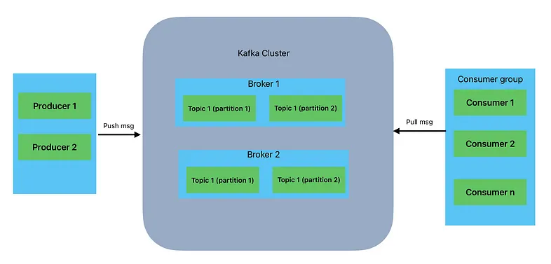

# Kafka

Kafka

## Clarification

- Imagine a library (Kafka topic) that stores books (messages). The library has several shelves (partitions), and each book needs to be placed on a shelf. Every message in a partition is assigned a unique ID known as an offset.

- Kafka guarantees ordering within a partition, but not across partitions. If message order matters, must ensure those messages go to the same partition by using a message key

