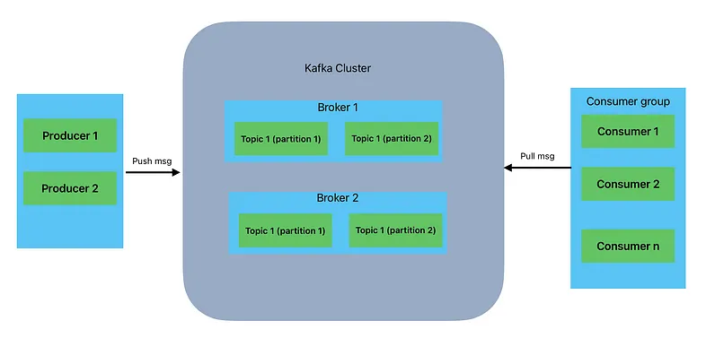
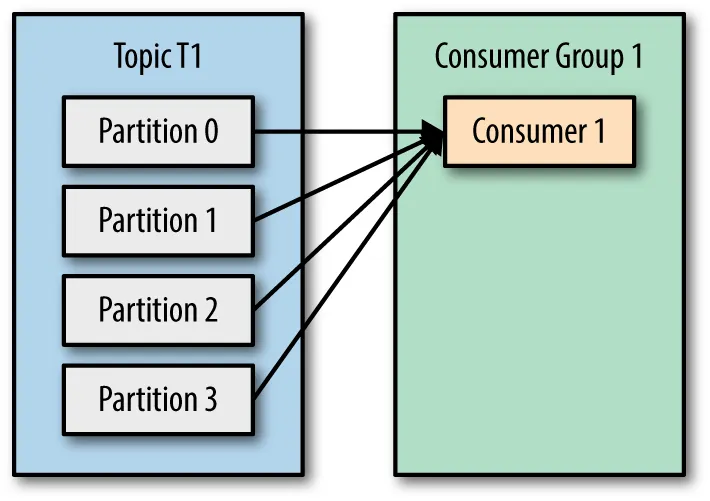
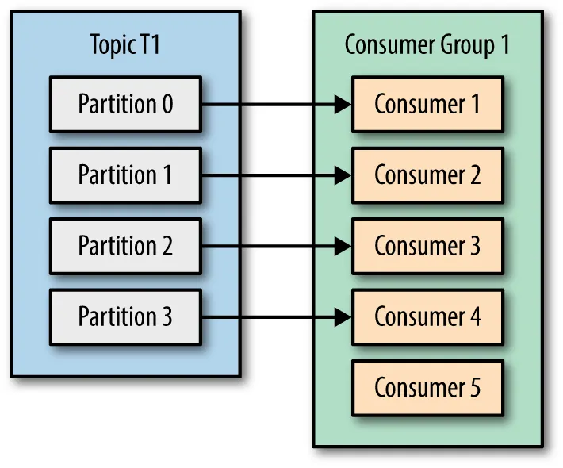
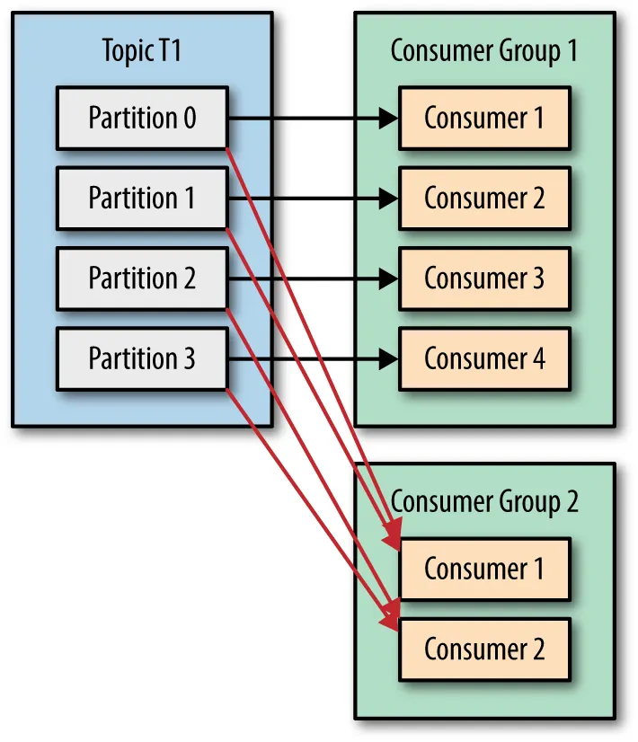

# Kafka

Kafka

## Core

Components: broker, producer, consumer, topic, partition, offset

Broker is a server which has Kafka running on. Multiple brokers would form a Kafka cluster

Imagine a library (Kafka topic) that stores books (messages). The library has several shelves (partitions), and each book needs to be placed on a shelf. Every message in a partition is assigned a unique ID known as an offset.

## List of common Q&A’s

Kafka NOT push messages to the consumer, instead it follow a pull strategy

A topic will default have 1 partition and a consumer must under 1 consumer group

Messages stored in Kafka are not deleted once consumed, but are deleted by either of the below approaches:
- after a certain time period (time-based retention)
- reach max message size of partition (size-based retention)

Kafka guarantees ordering within a partition, but not across partitions. If message order matters, must ensure those messages go to the same partition by using a message key (hash(key) % number_of_partitions)

Offset is an index pointing to the latest consumed message, used to keep a track of which messages have already been consumed. So if a consumer were to go down, this offset value would help us know exactly from where the consumer has to start consuming events

If two consumers have subscribed to the same topic and are present in the same consumer group, then these two consumers would be assigned a different set of partitions and none of these two consumers would receive the same messages.

### Consumer group

4 scenarios

- 1 consumer read from all the partitions
  

- consumers read from different partitions
  

- number of consumers less than number of partitions => the remaining consumer would be left idle
  

- multiple consumers read from the same partition by adding to different consumer groups
  

Kafka will rebalance when:
- new consumer joins
- existing consumer removed
- new partitions added
- existing consumer is considered dead by the Group coordinator

Group coordinator is a kafka broker which receives heartbeats from all consumers of a consumer group. Every consumer group has a group coordinator

The first consumer that joins a consumer group is called the Group Leader

Cannot decrease number of partitions because data sent to topics is sent to all partitions and removing one of them means data loss